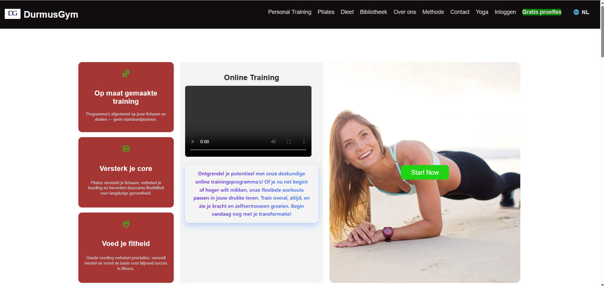
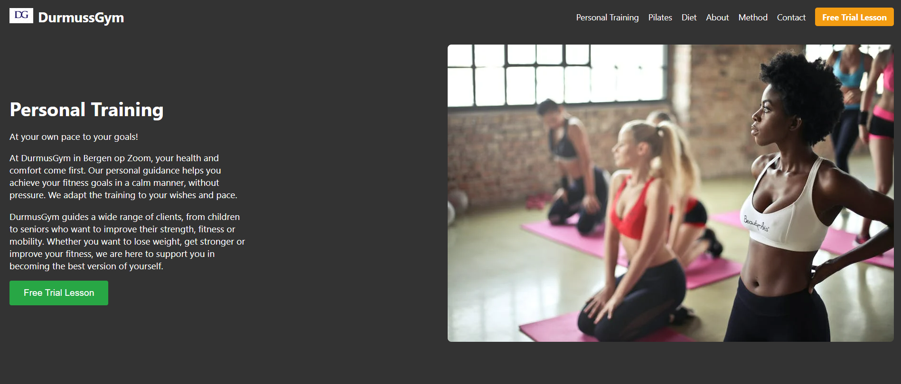

# DurmusGym

Embark on your fitness journey with DurmusGym, where health, fitness, and strength converge. Personalize your workout plan with our tailored methods, designed to perfectly match your unique goals and needs. Whether you're focusing on strength, flexibility, or overall wellness, DurmusGym is here to guide you every step of the way.

Visit our app: [DurmusGym](https://durmus-gym-fug4.vercel.app/)

---

## Technologies Used

The primary technologies and tools utilized in the development of this project include:

- **Frontend**: React
  
- **Backend**: Node.js
  
- **Database**: MongoDB Atlas
  
- **Test Automation**: Cypress
  
- **CI/CD Orchestration**: GitHub Actions
  
- **Language**: JavaScript
  

---

## Development and Deployment Workflow (CI/CD)

This project leverages a robust **Continuous Integration and Continuous Deployment (CI/CD)** pipeline to ensure high code quality and seamless deployments. This mechanism automates the development process, minimizes manual errors, and provides a reliable release cycle.

- **Continuous Integration (CI):** Every code merge into the `main` branch automatically triggers a pipeline. In this phase, the code is first deployed to a **staging environment**. This step ensures that new features are immediately available for testing in a near-production setting.

- **Continuous Deployment (CD):** Following the deployment to the staging environment, end-to-end tests are automatically executed using the **Cypress** test automation framework. These tests guarantee that the application functions as expected and that new changes do not break existing functionality.

- **Conditional Production Deployment:** The option for manual deployment to the production environment is **only enabled if all automated tests pass successfully**. This approach ensures that only thoroughly tested and stable code is promoted to the production environment, safeguarding the user experience.

This professional workflow aims to maximize the project's sustainability, reliability, and overall quality.

---

## Application Screenshots

You can see some features of our application below:

_Description: A screenshot showcasing the personal training section of the application._

_Description: A screenshot illustrating the main homepage layout._

_Description: A screenshot of a workout planning interface within the application._
